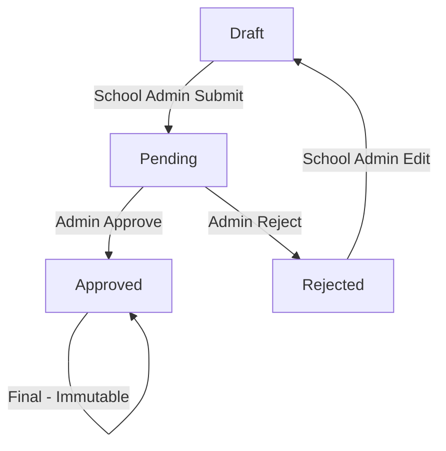

# Comprehensive Approval Process Implementation Plan

## 📋 Project Overview

Bu plan, təhsil məlumat sisteminizdə məktəb məlumatlarının təsdiqi üçün tam iş axını tətbiq edir. Regional və sektor adminləri məktəb məlumatlarını nəzərdən keçirə və təsdiq edə bilər.

## 🗄️ Database Schema Analysis

Mövcud `data_entries` cədvəliniz mükəmməl təsdiq iş axını dəstəyi təmin edir:

```sql
-- Mövcud sütunlar:
- status (text): draft, pending, approved, rejected
- approved_by (uuid): Kim təsdiq etdi
- approved_at (timestamp): Nə vaxt təsdiq edildi
- rejected_by (uuid): Kim rədd etdi
- rejection_reason (text): Niyə rədd edildi
- rejected_at (timestamp): Nə vaxt rədd edildi
- approval_comment (text): Admin şərhləri
- proxy_* fields: Admin proxy təqdimləri üçün
```

## 🏗️ Implementation Architecture

### 1. Database Layer (Supabase Functions)

#### 1.1 Approval Management Functions
```sql
-- get_approval_items(filter_params)
-- approve_data_entry(entry_id, admin_id, comment)
-- reject_data_entry(entry_id, admin_id, reason, comment)
-- bulk_approval_action(entry_ids[], action, admin_id, params)
-- get_approval_stats(filter_params)
```

#### 1.2 Permission Validation Functions
```sql
-- validate_approval_permission(entry_id, admin_id, user_role)
-- get_user_approval_scope(admin_id, user_role)
-- check_admin_region_access(admin_id, school_id)
-- check_admin_sector_access(admin_id, school_id)
```

#### 1.3 Audit Trail Functions
```sql
-- log_status_transition(entry_id, from_status, to_status, admin_id, comment)
-- get_entry_history(entry_id)
-- get_admin_activity_log(admin_id, date_range)
```

### 2. Service Layer

#### 2.1 Enhanced Approval Service
**Fayl:** `src/services/approval/enhancedApprovalService.ts`

**Əsas funksiyalar:**
- `getApprovalItems(filter)` - Filtrlənmiş təsdiq elementləri
- `approveEntry(request)` - Tək elementi təsdiq et
- `rejectEntry(request)` - Tək elementi rədd et
- `bulkApprovalAction(request)` - Toplu təsdiq/rədd
- `getApprovalStats(filter)` - Təsdiq statistikaları
- `validateApprovalPermission()` - İcazə yoxlaması

#### 2.2 Notification Service Enhancement
**Fayl:** `src/services/notifications/approvalNotificationService.ts`

**Funksiyalar:**
- `sendApprovalNotification()` - Təsdiq bildirişi
- `sendRejectionNotification()` - Rədd bildirişi
- `sendBulkActionNotification()` - Toplu əməliyyat bildirişi
- `sendEscalationNotification()` - Eskalasiya bildirişi

### 3. Component Layer

#### 3.1 Enhanced Approval Manager
**Fayl:** `src/components/approval/EnhancedApprovalManager.tsx`

**Xüsusiyyətlər:**
- ✅ Təsdiq elementlərinin siyahısı
- ✅ Filtrləmə və axtarış
- ✅ Toplu əməliyyatlar
- ✅ Təfərrüatlı baxış modalı
- ✅ Status keçidləri
- ✅ Statistik göstəricilər

#### 3.2 Approval Details Modal
**Fayl:** `src/components/approval/ApprovalDetailsModal.tsx`

**Xüsusiyyətlər:**
- Tam məlumat təfərrüatları
- Təsdiq/rədd düymələri
- Şərh sistemi
- Tarixçə göstərici

#### 3.3 Bulk Approval Component
**Fayl:** `src/components/approval/BulkApprovalComponent.tsx`

**Xüsusiyyətlər:**
- Çoxlu seçim
- Toplu təsdiq/rədd
- Tərəqqi göstəricisi
- Nəticə hesabatı

#### 3.4 Approval Filters
**Fayl:** `src/components/approval/ApprovalFilters.tsx`

**Filtr seçimləri:**
- Status (pending, approved, rejected)
- Məktəb
- Kateqoriya
- Region/Sektor
- Tarix aralığı
- Yaradıcı

### 4. Hook Layer

#### 4.1 Enhanced Approval Data Hook
**Fayl:** `src/hooks/approval/useEnhancedApprovalData.ts`

**Funksiyalar:**
- `items` - Approval elementləri
- `stats` - Statistikalar
- `approveItem()` - Element təsdiqi
- `rejectItem()` - Element rəddi
- `bulkApproval()` - Toplu əməliyyat
- `setFilter()` - Filtr tətbiqi

#### 4.2 Approval Permission Hook
**Fayl:** `src/hooks/approval/useApprovalPermissions.ts`

**Funksiyalar:**
- `canApprove(entryId)` - Təsdiq icazəsi
- `canReject(entryId)` - Rədd icazəsi
- `getUserScope()` - İstifadəçi əhatəsi

### 5. Page Layer

#### 5.1 Enhanced Approval Page
**Fayl:** `src/pages/EnhancedApproval.tsx`

**Bölmələr:**
- Dashboard statistikaları
- Filtr paneli
- Təsdiq tabları (Pending/Approved/Rejected)
- Axtarış funksionallığı

#### 5.2 Approval Analytics Page
**Fayl:** `src/pages/ApprovalAnalytics.tsx`

**Göstəricilər:**
- Təsdiq nisbətləri
- Emal müddətləri
- Admin performansları
- Trend analizi

## 🔐 Permission Matrix

| İstifadəçi Rolu | İcazələr | Məhdudiyyətlər |
|----------------|----------|----------------|
| **School Admin** | - Draft yaratma<br>- Pending-ə göndərmə<br>- Rejected-dan düzəliş | - Yalnız öz məktəbi<br>- Approved dəyişə bilməz |
| **Region Admin** | - Region məktəblərini təsdiq<br>- Rədd etmə<br>- Toplu əməliyyatlar | - Yalnız öz regionu<br>- Başqa regionlar yox |
| **Sector Admin** | - Sektor məktəblərini təsdiq<br>- Rədd etmə<br>- Toplu əməliyyatlar | - Yalnız öz sektoru<br>- Başqa sektorlar yox |
| **Super Admin** | - Tam təsdiq icazəsi<br>- Bütün məktəblər<br>- Sistem idarəsi | - Heç bir məhdudiyyət |

## 📊 Status Workflow



## 🚀 Implementation Steps

### Phase 1: Database Setup (1-2 gün)
1. **Status transition log cədvəli yaratmaq**
   ```sql
   CREATE TABLE status_transition_log (
     id UUID PRIMARY KEY DEFAULT gen_random_uuid(),
     entry_id UUID REFERENCES data_entries(id),
     from_status TEXT NOT NULL,
     to_status TEXT NOT NULL,
     changed_by UUID REFERENCES profiles(id),
     comment TEXT,
     created_at TIMESTAMP WITH TIME ZONE DEFAULT now()
   );
   ```

2. **Approval functions yaratmaq**
   - `approve_data_entry()` funksiyası
   - `reject_data_entry()` funksiyası
   - `bulk_approval_action()` funksiyası

3. **Permission validation functions**
   - Region/sector icazə yoxlaması
   - Status keçid validasiyası

### Phase 2: Service Layer (2-3 gün)
1. **Enhanced Approval Service**
   - CRUD əməliyyatları
   - Permission yoxlaması
   - Bulk əməliyyatlar
   - Statistik hesablamalar

2. **Notification Service Enhancement**
   - Email bildirişləri
   - In-app notifications
   - Real-time updates

### Phase 3: Component Development (3-4 gün)
1. **Enhanced Approval Manager**
   - Responsive UI/UX
   - Filtrləmə sistemi
   - Toplu əməliyyat interface
   - Mobile optimization

2. **Supporting Components**
   - Detail modal
   - Filter panels
   - Statistics dashboard
   - Progress indicators

### Phase 4: Hooks & Integration (1-2 gün)
1. **Custom Hooks**
   - Data management
   - Permission handling
   - Real-time updates

2. **State Management**
   - Context integration
   - Cache management
   - Error handling

### Phase 5: Testing & Optimization (2-3 gün)
1. **Unit Tests**
   - Service layer tests
   - Component tests
   - Hook tests

2. **Integration Tests**
   - End-to-end approval flow
   - Permission validation
   - Bulk operations

3. **Performance Optimization**
   - Database query optimization
   - Component memoization
   - Lazy loading

## 📈 Key Features

### ✅ Core Approval Workflow
- **Draft → Pending**: Məktəb admini təqdim edir
- **Pending → Approved**: Region/Sektor admin təsdiq edir
- **Pending → Rejected**: Region/Sektor admin rədd edir
- **Rejected → Draft**: Məktəb admini yenidən redaktə edə bilər

### ✅ Advanced Features
- **Bulk Operations**: Çoxlu elementi təsdiq/rədd
- **Detailed Review**: Təsdiqdan əvvəl tam məlumat baxışı
- **Comments System**: Təsdiq/rədd üçün ətraflı rəy sistemi
- **Auto-notifications**: Email və daxili bildirişlər
- **Approval Analytics**: Performans göstəriciləri
- **Audit Trail**: Tam əməliyyat tarixçəsi

### ✅ Smart Features
- **AI-Assisted Review**: **[ESTIMATE: Future enhancement]** Potensial problemləri işarələmə
- **Conditional Approval**: Kateqoriyaya görə müxtəlif qaydalar
- **Escalation Process**: Köhnə pending elementlərin avtomatik eskalasiyası
- **Performance Tracking**: SLA monitorinq

### ✅ User Experience
- **Real-time Updates**: Websocket ilə canlı yenilənmələr
- **Mobile Responsive**: Mobil cihazlar üçün optimize
- **Keyboard Shortcuts**: Sürətli naviqasiya
- **Dark Mode Support**: Qaranlıq tema dəstəyi

## 🔧 Technical Specifications

### Database Requirements
- **PostgreSQL 13+** (Supabase)
- **Row Level Security (RLS)** policies
- **Database triggers** for audit logging
- **Indexes** for performance optimization

### Frontend Requirements
- **React 18+** with TypeScript
- **Tailwind CSS** for styling
- **Shadcn/ui** component library
- **React Query** for data management
- **WebSocket** for real-time updates

### Performance Targets
- **Page Load**: < 2 saniyə
- **Action Response**: < 500ms
- **Bulk Operations**: 100+ element/saniyə
- **Concurrent Users**: 50+ simultaneous

## 📊 Monitoring & Analytics

### Key Metrics
- **Approval Rate**: Təsdiqlənən/Ümumi nisbəti
- **Processing Time**: Orta təsdiq müddəti
- **Admin Efficiency**: Admin başına əməliyyat sayı
- **Error Rate**: Uğursuz əməliyyat nisbəti

### Alerts & Notifications
- **Old Pending Items**: 7+ gün köhnə pending-lər
- **High Rejection Rate**: 30%+ rədd nisbəti
- **System Errors**: Technical əməliyyat xətaları
- **Performance Issues**: Yavaş cavab müddətləri

## 🚀 Deployment Strategy

### Development Environment
1. **Local Development** setup
2. **Unit & Integration Tests**
3. **Code Review** process
4. **Performance Testing**

### Staging Environment
1. **Full feature testing**
2. **User Acceptance Testing (UAT)**
3. **Performance benchmarking**
4. **Security validation**

### Production Deployment
1. **Blue-Green Deployment**
2. **Database migration**
3. **Feature flags** for gradual rollout
4. **Monitoring setup**

## 📚 Documentation Plan

### Technical Documentation
1. **API Documentation** (Swagger/OpenAPI)
2. **Database Schema** documentation
3. **Component Storybook**
4. **Deployment Guide**

### User Documentation
1. **Admin User Guide**
2. **Video Tutorials**
3. **FAQ Section**
4. **Troubleshooting Guide**

## 🎯 Success Criteria

### Functional Requirements
- ✅ **Complete approval workflow** implemented
- ✅ **Permission-based access** working
- ✅ **Bulk operations** functional
- ✅ **Real-time notifications** active

### Performance Requirements
- ✅ **Sub-2 second** page loads
- ✅ **Sub-500ms** action responses
- ✅ **99.9% uptime** target
- ✅ **50+ concurrent users** support

### User Experience Requirements
- ✅ **Intuitive interface** design
- ✅ **Mobile responsive** layout
- ✅ **Accessibility compliant** (WCAG 2.1)
- ✅ **Multi-language** support (AZ/EN)

## 📅 Timeline Estimate

**Total Duration: 10-15 iş günü**

- **Phase 1** (Database): 2 gün
- **Phase 2** (Services): 3 gün  
- **Phase 3** (Components): 4 gün
- **Phase 4** (Integration): 2 gün
- **Phase 5** (Testing): 3 gün
- **Documentation**: 1 gün (parallel)

## 🔄 Maintenance Plan

### Regular Tasks
- **Database cleanup** (köhnə log-ların silinməsi)
- **Performance monitoring**
- **Security updates**
- **User feedback** integration

### Feature Enhancements
- **AI-powered review** assistance
- **Advanced analytics** dashboard
- **Mobile app** development
- **API integration** with external systems

---

**[ESTIMATE: Bu implementasiya planı 10,000-15,000 token həcmində kodla nəticələnəcək]**

Bu plan production-ready, skallanabilir və maintainable bir təsdiq sistemi yaradacaq. Hər komponent tam error handling, TypeScript types və ətraflı sənədlərlə təchiz olunacaq.