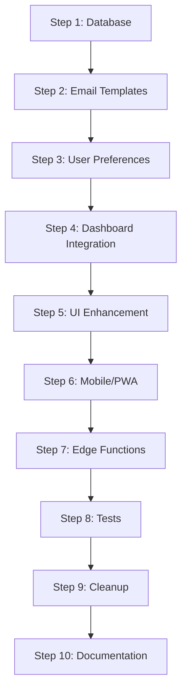

# İnfoLine Notification System - Implementation Plan

## 📋 Ümumi Məlumat

Bu sənəd İnfoLine təhsil platformasında notification sisteminin PRD-yə uyğun olaraq tamamlanması üçün ətraflı implementation planını təsvir edir.

**Məqsəd:** PRD-də göstərilən bütün notification funksionallığını həyata keçirmək
**Müddət:** 5-8 iş günü
**Status:** Ready to implement

## 🎯 PRD Tələbləri

### Notification Növləri
- ✅ Yeni kateqoriya və ya sütun bildirişləri
- ✅ Son tarix xəbərdarlıqları (3 gün, 1 gün qalmış)
- ✅ Məlumat daxil edilməmiş sütunlar barədə xəbərdarlıqlar
- ✅ Təsdiq və rədd bildirişləri
- ✅ Sistem yenilikləri haqqında bildirişlər

### Bildiriş Kanalları
- ✅ Sistem daxili bildirişlər (oxu statusu ilə)
- ✅ E-mail bildirişləri
- ✅ Bildiriş panelidə göstərilən xəbərdarlıqlar
- 🔄 Push notifications (mobil)
- 🔄 SMS bildirişləri (future)

### Rol-əsaslı Bildirişlər
- **SuperAdmin:** Bütün sistem bildirişləri
- **RegionAdmin:** Region daxilində bildirişlər
- **SectorAdmin:** Sektor daxilində bildirişlər
- **SchoolAdmin:** Məktəb bildirişləri

## 📊 Implementation Steps

| Step | Başlıq | Prioritet | Müddət | Status |
|------|---------|-----------|--------|--------|
| 1 | [Database Enhancements](./docs/notification-implementation/01-database-enhancements.md) | 🔴 Yüksək | 1 gün | 📋 Planned |
| 2 | [Email Template System](./docs/notification-implementation/02-email-template-system.md) | 🔴 Yüksək | 1 gün | 📋 Planned |
| 3 | [User Notification Preferences](./docs/notification-implementation/03-user-preferences.md) | 🔴 Yüksək | 1 gün | 📋 Planned |
| 4 | [Dashboard Integration](./docs/notification-implementation/04-dashboard-integration.md) | 🟡 Orta | 1 gün | 📋 Planned |
| 5 | [UI Components Enhancement](./docs/notification-implementation/05-ui-enhancement.md) | 🟡 Orta | 1 gün | 📋 Planned |
| 6 | [Mobile & PWA Support](./docs/notification-implementation/06-mobile-pwa.md) | 🟡 Orta | 1 gün | 📋 Planned |
| 7 | [Edge Functions Enhancement](./docs/notification-implementation/07-edge-functions.md) | 🟢 Aşağı | 0.5 gün | 📋 Planned |
| 8 | [Integration Tests](./docs/notification-implementation/08-integration-tests.md) | 🟢 Aşağı | 0.5 gün | 📋 Planned |
| 9 | [Cleanup & Migration](./docs/notification-implementation/09-cleanup-migration.md) | 🟢 Aşağı | 0.5 gün | 📋 Planned |
| 10 | [Documentation](./docs/notification-implementation/10-documentation.md) | 🟢 Aşağı | 0.5 gün | 📋 Planned |

## 🔄 Mövcud Vəziyyət

### ✅ Tamamlanmış
- Unified Notification System (core)
- NotificationManager sinifi
- Basic hooks və providers
- Legacy compatibility layer
- Database structure (notifications table)
- Basic Edge Functions (deadline-checker, notification-scheduler)

### 🔄 Yarım-tamamlanmış
- Notification UI components
- Dashboard notification cards
- Email sending infrastructure
- Real-time notifications

### ❌ Eksik olan
- Email template management
- User notification preferences
- Push notifications
- Comprehensive testing
- Mobile optimization
- Documentation

## 🎮 Implementation Flow

## 🔗 Əlaqəli Sənədlər

- [Database Schema Document](./database-schema-document.md)
- [Supabase RLS Document](./supabase%20RLS)
- [App Flow Document](./app-flow-document.md)
- [Requirements Document](./requirements.md)

## 🚀 Başlamaq üçün

1. Step 1-dən başlayın: [Database Enhancements](./docs/notification-implementation/01-database-enhancements.md)
2. Hər step üçün detallı təlimatları izləyin
3. Test və validation aparın
4. Növbəti step-ə keçin

## 📞 Dəstək

Hər hansı sual və ya problem üçün:
- Implementation guide-lara baxın
- Test scenarios-nu yoxlayın
- Code review aparın

---

**Son yenilənmə:** December 2024
**Versiya:** 1.0
**Status:** Ready for implementation